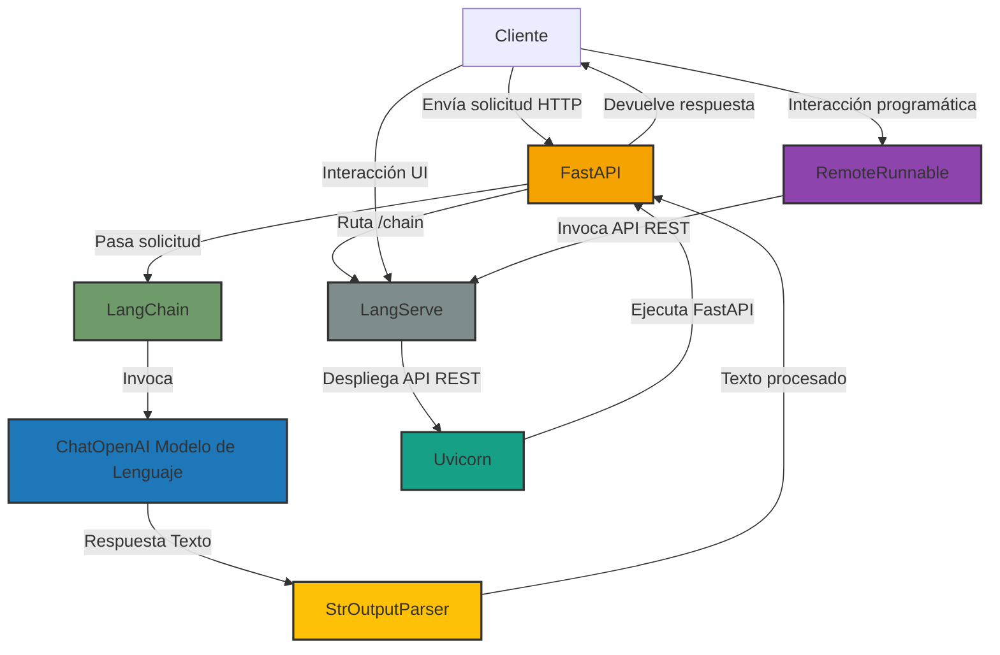

# AREP - Taller LLM
## Autor: David Leonardo Piñeros Cortés

El objetivo de este taller es construir una aplicación web simple para la traducción de texto usando
LangChain y un modelo de lenguaje LL.

### Arquitectura

La arquitectura de la aplicación se resumen en un cliente que interactúa con el servidor a través de solicitudes HTTP, ya sea directamente o mediante la UI proporcionada por LangServe. FastAPI gestiona las solicitudes y las pasa a LangChain, que está compuesto por el modelo de lenguaje ChatOpenAI y el StrOutputParser para procesar las respuestas.
LangServe expone la API REST y se ejecuta mediante Uvicorn, que maneja las solicitudes y coordina la ejecución del servidor. Finalmente RemoteRunnable permite que el cliente interactúe con el servidor de manera programática.

### Instalación y Ejecución
